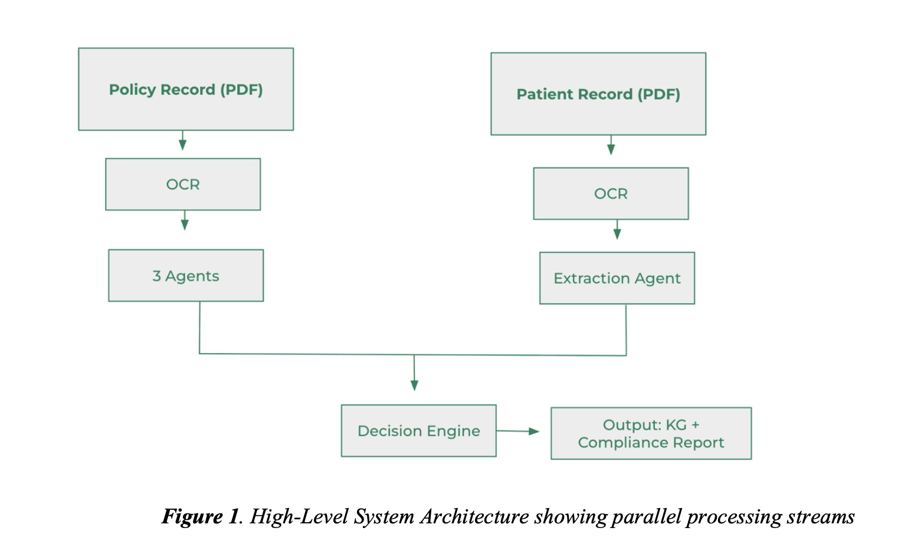
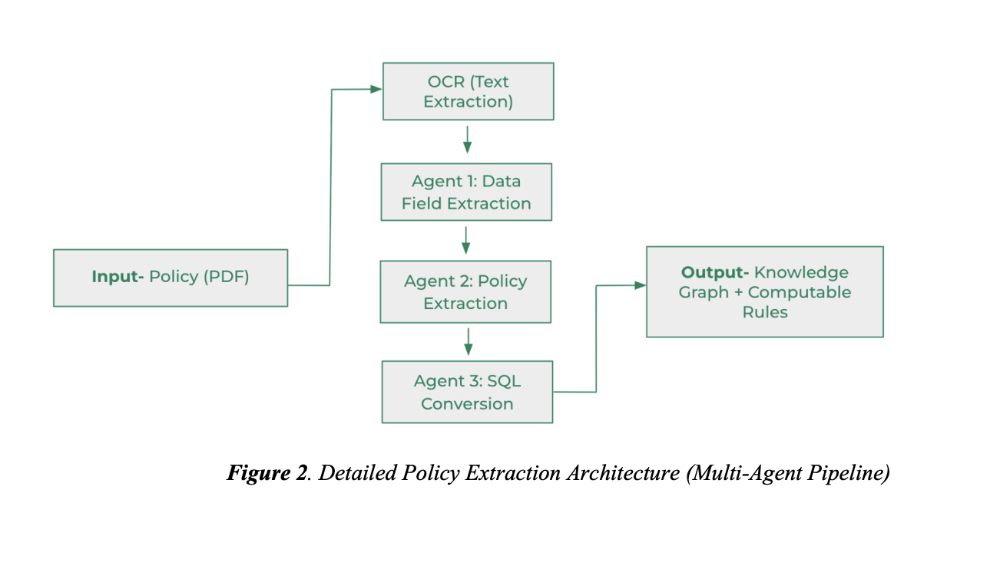
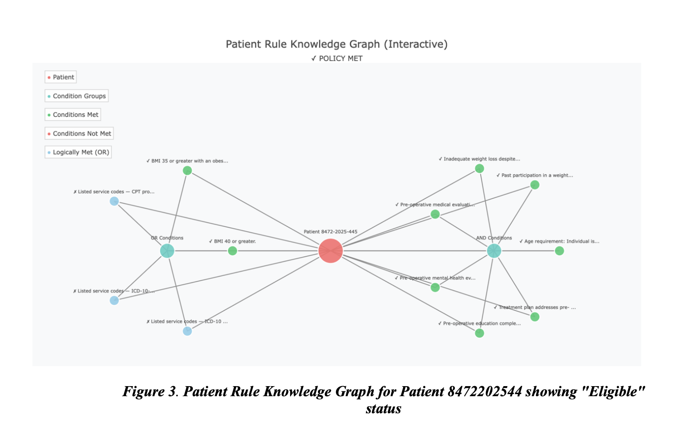
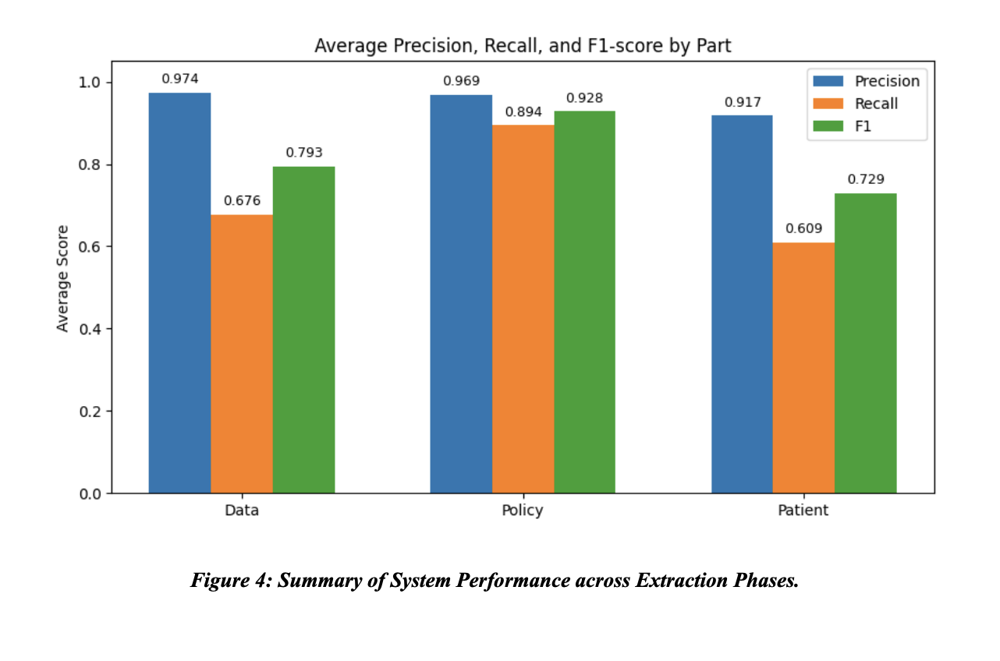

# Medical Policy Knowledge Graph System: Documentation

## 1. Executive Summary
[cite_start]Modern healthcare delivery is burdened by the manual, inconsistent interpretation of complex medical coverage policies[cite: 13]. [cite_start]This system provides a scalable solution by automatically translating unstructured PDF medical policies into computable SQL rules and visual Knowledge Graphs[cite: 17, 20]. [cite_start]The Policy Automation component effectively transforms a manual review process into an automated pipeline, allowing for reduced claim denials by visually pinpointing missing requirements prior to submission[cite: 23, 24].

## 2. Problem Statement
* [cite_start]**Administrative Overhead**: Medical and operational policies are complex, frequently updated, and interpreted differently across teams, making consistent decisions difficult[cite: 38].
* [cite_start]**Scalability & Delays**: Manual interpretation limits scalability, introduces significant delays, and lacks a transparent audit trail for why a specific coverage decision was made[cite: 39].
* [cite_start]**Financial Impact**: Hospitals face an estimated $17.4 billion in unplanned costs annually due to fragmented care and policy interpretation gaps[cite: 31]. [cite_start]The administrative cost to rework a single denied claim is estimated between $25 and $118[cite: 68].

## 3. System Architecture
[cite_start]The architecture is built upon a dual-stream pipeline that processes medical policies and patient records in parallel before converging at a decision engine[cite: 89, 91].

[cite_start]*Figure 1: High-Level System Architecture showing parallel processing streams* [cite: 101]

### 3.1 Policy Processing Stream
[cite_start]This stream transforms narrative policy text into executable logic through four stages[cite: 112, 126]:
1. [cite_start]**OCR (Text Extraction)**: Converts PDF documents into machine-readable text using a dual-technology approach (PyMuPDF and Tesseract) to handle complex layouts and tables[cite: 127, 128].
2. [cite_start]**Agent 1: Data Field Extraction**: Constructs a Policy Data Dictionary by identifying all clinical data fields referenced in the policy (e.g., `patient_bmi`, `patient_age`)[cite: 130, 132].
3. [cite_start]**Agent 2: Policy Extraction**: Decomposes narrative statements into atomic logical rules (e.g., `((BMI >= 40) OR (BMI >= 35 AND Comorbidity = True))`)[cite: 133, 138].
4. [cite_start]**Agent 3: SQL Conversion**: Translates structured rules into an executable SQL WHERE clause[cite: 140, 141].

[cite_start]*Figure 2: Detailed Policy Extraction Architecture (Multi-Agent Pipeline)* [cite: 124]

### 3.2 Patient Record Processing Stream
* [cite_start]**Medical Record Parser**: Guided by the Data Dictionary, this agent interprets clinical context from unstructured physician notes to populate required fields[cite: 148].
* [cite_start]**Normalization**: Handles variability in medical terminology (e.g., mapping "HTN" to "Hypertension" or "I10" to an ICD code)[cite: 106].

## 4. Compliance Evaluation & Visualization
[cite_start]The Decision Engine brings together outputs from both streams to systematically evaluate eligibility[cite: 108].
* [cite_start]**Condition-Level Evaluation**: Compares clinical values with policy thresholds using data-type-aware logic[cite: 170].
* [cite_start]**Knowledge Graph Generation**: Color-coded visualization (Green for satisfied, Red for unmet) provides immediate interpretability and rapid clinical review[cite: 176, 177].

[cite_start]*Figure 3: Patient Rule Knowledge Graph showing "Eligible" status for Bariatric Surgery* [cite: 167]

## 5. Technical Validation
[cite_start]Validation utilized a structured "LLM-as-a-Judge" methodology to assess reasoning capabilities across extraction phases[cite: 185, 186, 187]. [cite_start]Diverse models (Claude 4.5 Sonnet and Gemini 3 Pro) and strategies (Zero-shot and Chain-of-Thought) were used to ensure objective scoring[cite: 188, 189, 191].

### 5.1 Phase 1: Data Dictionary Extraction Performance
[cite_start]**Objective**: Evaluate how accurately the system identifies structured variable definitions (CPT codes, coverage booleans, etc.) from policy text[cite: 196].

| Metric | Score | Assessment |
| :--- | :--- | :--- |
| **Precision** | **0.974** | [cite_start]Near Perfect: The system rarely "hallucinated" fields. Almost every extracted variable was supported by the text[cite: 198]. |
| **Recall** | **0.676** | [cite_start]Moderate: The system missed some administrative nuances, such as specific provider specialty requirements[cite: 198]. |
| **F1-Score** | **0.793** | [cite_start]Strong Baseline: A solid foundation for building the knowledge graph[cite: 198]. |
[cite_start]*Table 1: Phase 1 Average Performance (PNS Policy)* [cite: 199]

### 5.2 Phase 2: Policy Condition Extraction Performance
[cite_start]**Objective**: Evaluate the system's ability to convert complex natural language clauses into computable logical rules[cite: 201].

| Metric | Score | Assessment |
| :--- | :--- | :--- |
| **Precision** | **0.969** | [cite_start]High Reliability: The system accurately captured the logic for core rules[cite: 207]. |
| **Recall** | **0.894** | [cite_start]High Completeness: The system successfully extracted the vast majority of eligibility criteria[cite: 212]. |
| **F1-Score** | **0.928** | [cite_start]Excellent: This is the highest-performing phase, indicating the system is highly effective at structuring clinical policy logic[cite: 213]. |
[cite_start]*Table 2: Phase 2 Average Performance (PNS Policy)* [cite: 214]

### 5.3 Phase 3: Patient Condition Extraction Performance
[cite_start]**Objective**: Evaluate the accuracy of extracting clinical facts (contraindications, prior failures) from unstructured records[cite: 216].

| Metric | Score | Assessment |
| :--- | :--- | :--- |
| **Precision** | **0.917** | [cite_start]Safe Extraction: The system did not infer clinical facts that were not present in the text[cite: 217]. |
| **Recall** | **0.609** | [cite_start]Conservative: The system missed some implicit concepts, such as calculating durations from text or inferring unlisted codes[cite: 222]. |
| **F1-Score** | **0.729** | [cite_start]Good: The extraction is reliable for explicit facts but requires refinement for inferential reasoning[cite: 226]. |
[cite_start]*Table 3: Phase 3 Average Performance (Patient Record L37360_001)* [cite: 227]

### 5.4 Validation Logs

For the full, verbatim transcripts of the LLM prompts and raw JSON outputs used to derive these consensus metrics, please refer to the Technical Appendix.

**Figure 4. Summary of System Performance across Extraction Phases**

[cite_start]*Figure 4: Summary of System Performance across Extraction Phases*[/cite_end] [cite: 244]

## 6. Limitations & Future Roadmap
* [cite_start]**Unstable Extraction**: LLM-based extraction may fail on rare edge cases or deeply nested logical structures[cite: 268, 269].
* [cite_start]**Lack of Oversight**: The current pipeline lacks a Human-in-the-Loop (HITL) validation mechanism for low-confidence or high-risk decisions[cite: 270].
* **Interoperability**: Medical code coverage is currently limited to CPT and ICD-10; [cite_start]future work includes UMLS and HL7/FHIR integration[cite: 272, 278, 518, 520].

---
*This document is under active development as part of the **CMU x Zyter Capstone Project**.*